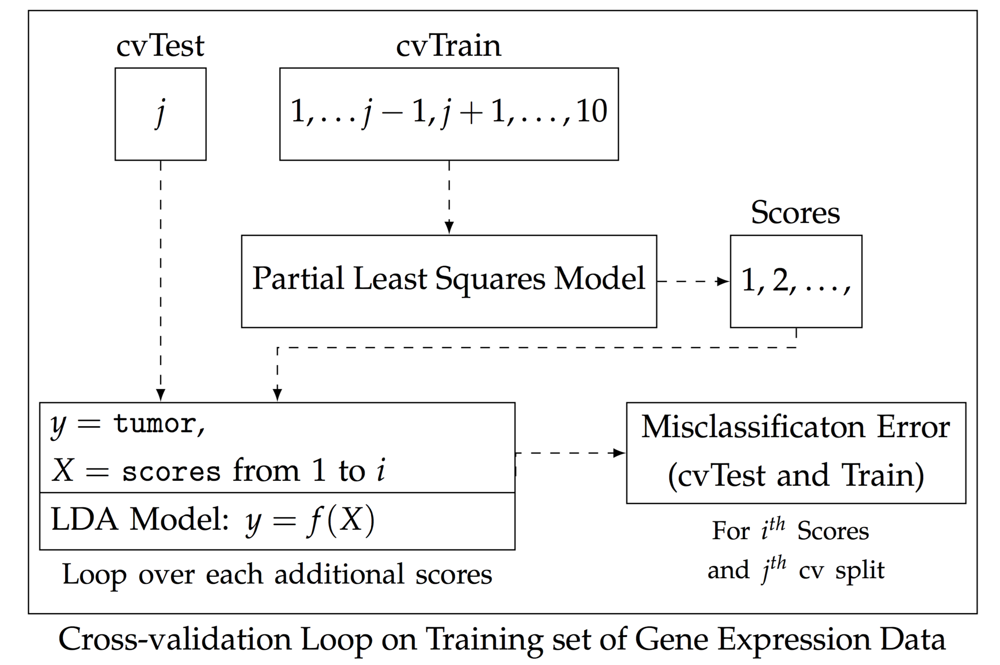
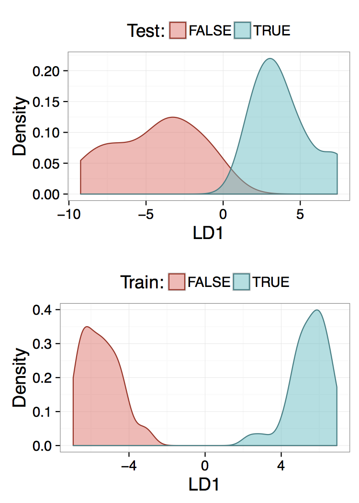
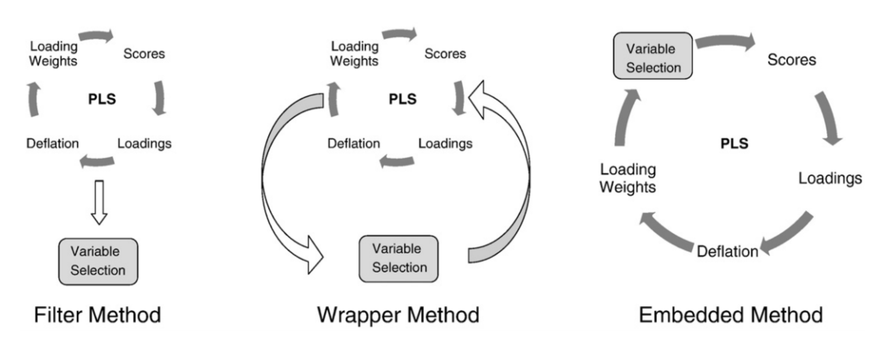

```{r setup, include=FALSE}
knitr::opts_chunk$set(echo = FALSE, comment = NA, 
                      fig.height = 4.5,
                      fig.width = 9,
                      fig.align = 'center',
                      message = FALSE, 
                      warning = FALSE)
knitr::read_chunk("Main.R")
```

```{r}
htmltools::tags$link(href = "Style.css", rel = "stylesheet")
knitr::knit_hooks$set(htmlcap = function(before, options, envir) {
  if (!before) {
      paste0('<p class="mycaption"><strong>', 
             if (is.null(options$caplab)) 'Fig' else options$caplab, 
             ': </strong>',
             options$htmlcap,
             "</p>")
    }})
source('funScript/basicFun.R')
source("funScript/plda.R")
```

```{r loadPackage}
```
```{r dataLoad}
```

# Introduction
Simple and informative models is always preferred to complex model. Different variable selection techniques are compared on the basis of their performance on various nature of data. Table-1 presents an overview of the datasets used in this study. All the data are pre-processed using different techniques such as baseline correction and smoothing before they are used in this study.
```{r}
dataDesc <- data.table(
  Datasets = paste0(c('`MALDITOF_Milk`', '`NIR_Raman_PUFA`', '`GeneExpr_Prostate`')),
  Types = c('Spectrometric', 'Spectroscopic', 'Microarray'),
  `Response Variables` = paste0(c(paste('`cow`', '`goat`', '`ewe`', sep = ', '), paste('`PUFA_total`', '`PUFA_fat`', sep = ', '), '`tumor`')),
  `Predictor Variables` = c(
    "Mass Spectra (`MS`)", "`NIR` and `Raman`", "Gene Expression (`GeneExpr`)"
  )
)
```

```{r}
knitr::kable(dataDesc, caption = "**Table 1:** Overview of Datasets")
```

**MALDI-TOF (Matrix-assisted laser ionization - Time of Flight)** is a mass spectrometric technique known for identifying proteins, peptides and some other ionisable compounds in samples, as explained in @liland2009quantitative (Figure: 1; top-left). 

```{r samplePlot, htmlcap = "Sample observations from a) MALDI-TOF (top-left) b) NIR (top-right) c) Raman (bottom-left) and d) GeneExpression (bottom-right)", caplab = "Figure 1"}
```

**Near Infrared (NIR)** and **Raman** are spectroscopic techniques where the frequencies of reflected light from a vibrating molecules are measured. In the case of Raman spectroscopy, measurement is made only on raman shift, it is able to detect wider range of molecules than NIR (Figure 1; top-right and bottom-left). Here, the techniques are used to measure the percentage of polyunsaturated fatty acids in a) total sample weight b) total fat content [@naes2013multi]. **Gene Expression** is a microarray data which contains a Gene Expression Matrix and a response vector which identify whether the sample contains tumor or not. A raw microarray data are images which are transformed into gene expression matrix that contains gene for each sample (Figure 1; bottom-right).

```{r}
varSelDesc <- data.table(
  Methods = c('Jack Knife', '`mcuv`', 'Shaving (`sMC`)','Truncation'),
  Types = c('Filter', 'Wrapper', 'Wrapper', 'Embeded'),
  `Description` = c(
    'Jack Knifing is used for variable selection where variables having p-value less than 0.05 are only selected.',
    'Predictor variables having lower "importance" than the artificial noise added to the predictors set are eliminated before model fitting. The process is repeated until a criterion is attained.',
    'Variables are sorted with respect to some importance measure using `sMC` from which least informative variables are eliminated using a threshold value. A model is fitted again with remaining variables and the procedure is repeated until maximum model performance is achieved.',
    'During the model fitting, based on confidence interval for modeling, loading weights are truncated around their median before returning to the NIPALS algorithm again.'
  )
)
```

# Statistical Models

## Principal Component Analysis (PCA)
PCA enables the underlying structure present in a dataset by transforming variables into a new set of uncorrelated variables. PCA is used to reduce the dimension of dataset consisting of correlated variables, retaining most of the variation present in it on first few PCs.
  
In this study, the first and second principal components are plotted, in figure - 2 (top-left), which are linear combinations of original variables. The PC of MALDI-TOF are colored according to milk proportion of cow, goat and ewe which revels clusters present in the mass-spectra at three different corners. A similar grouping is visible on gene expression data in figure - 2 (top-right) where the points are colored according to there state of having tumor or not.

Further, the principal components of NIR and Raman datasets in figure - 2 (bottom) shows that higher concentration of PUFA are separated by first principal component in NIR and second principal component in Raman dataset.

```{r PCA}
```

```{r scorePlots, fig.height=5, htmlcap = "Principal components of (top-left) MALDI-TOF dataset with colored proportion of cow, goat and ewe milk, (top-right) Gene Expression dataset with presence and absense of tumer on the sample, (bottom) NIR and Raman dataset with opacity factor with percentage of (left) PUFA in total sample and (right) PUFA in total fat content", caplab = "Figure 2"}
```


## Calibration and Validation
Model validation ensures how the model will perform on completely new environment, i.e. with observations on included for its calibration. For _external validity_[@martens2001multivariate], datasets are splitted into training and test sets with 70 percent of observations taken as training set while rest as test set. However, due to replications, MALDI-TOF milk data is splitted into 3:2 ratio such that the replications are bind together. An _internal validation_[@martens2001multivariate] is done on the training set with 10 fold random cross-validation except on MALDI-TOF milk. On MALDI-TOF data a consecutive splitting is made with 30 folds which hence ensure each set of replication creates a fold. Further, the models calibrated with cross-validation from training set are used for predicting test set.

## Partial Least Square (PLS) Regression
PLS uses the latent structure for modeling the relation between matrices $\mathbf{X}$ and $\mathbf{Y}$. Latent variables of both $\mathbf{X}$ and $\mathbf{Y}$ are modeled to explain the variance structure (direction) present in $\mathbf{Y}$. Flawless performance on wide matrices (where variables are more than observations) and correction of multicollinearity are the advantages of Partial Least Square Regression.

```{r DataSplit}
```
```{r Model_Fitting}
```
```{r Validation}
```
```{r ValidationPlots, fig.height=5, htmlcap = "Maximum variation explained on response in Milk, NIR and Raman dataset and maximium correct classification proportion for gene Expression dataset. Each line represent a model for which the R2 predicted is calculated with number of components chosen by cross-validation (end of each line).", caplab = "Figure 3"}
plt.list <- lapply(names(r2), function(x){
  plot(r2[[x]], full = FALSE) + ggtitle(toupper(x)) + theme(title = element_text(size = 7))
})
plot_grid(plotlist = plt.list, align = 'v', nrow = 2)
```

A PLS model with cross-validation is fitted on training set of all the datasets with individual responses (i.e. one response per model). A measure of maximum $R^2$ predicted is used as a validation tool. The number of components, needed for explaining most of the variation present in the response, obtained from cross-validation is used for test prediction. For classification of tumor or non-tumor in Gene Expression dataset, a modified PLS model is used where the scores from PLS model, with number of components needed for minimum RMSECV, is used as predictor variable in Linear Discriminant Analysis (LDA) model. A final model, with maximum average correct classification proportion, is used to predict the test set.

Mostly, the variation explained in test are smaller than cross-validation in figure - 3 while on few of them it is larger than cross-validation. Plots from spectroscopic data shows that NIR data are able to explain _PUFA present in total_ better than Raman while Raman is better is explaining _PUFA in fat_. Since number of components from cross-validation are used, the model fitted for goat response in MALDI-TOF data has 70 components and is performing poor in test data for which the presence of noise with inclusion of more components may be the reason behind.  However, in all the cases, more than 65% of the variation on test is explained by the chosen PLS model.

## Linear Discriminent Analysis
Assuming equal variance for each group, LDA attempts to classify/ discriminate the response $\mathbf{y}$ using a log-odd function, linear on $\mathbf{X}$, i.e, LDA decision boundaries are linear [@friedman2001elements]. Subjects with and without tumor, in Gene Expression data are classified using a LDA model from PLS scores. The number of components is obtained from a cross-validation technique, as in figure - 4, which integrates LDA and PCA to obtain optimized number of components that minimize the misclassification error. The first Linear Discriminant score plotted for training and testset for their prediction (figure - 4; right) shows that the model has classified the presence of tumor with high accuracy.

```{r classify}
```

```{r classifyPlot}
```

<div class = "img-row">
<div class = "left">



</div>

<div class = "right">



</div>
</div>
<div class = "mycaption"> 
**Figure 4:** Maximum variation explained on response in Milk, NIR and Raman dataset and maximium correct classification proportion for gene Expression dataset. Each line represent a model for which the R2 predicted is calculated with number of components chosen by cross-validation (end of each line).
</div>


# Variable Selection
```{r Subset_Models}
```

Variable selection techniques as suggested in @mehmood2012review are implemented on each dataset and a comparison is made with the model fitted with complete set. @mehmood2012review have categorized the variable selection technique into three different categories: Filter, Wrapper and Embedded methods (Figure 5). An overview of methods used in this study in presented in Table - 2.

```{r}
knitr::kable(varSelDesc, caption = "**Table 2: ** An overview of Variable selection methods used")
```




<div class = "mycaption">
**Figure 5:** Illustration of Variation Selection Techniques
</div>

## Filter Method
Filter method selects variables from a fitted PLS model introducing a threshold on some measure such as Loading Weights, Regression Coefficients and Variable Importance in Projection (VIP). VIP is used as a filter method in this study with a threshold value of 1. Since, only the important variables are selected and with reduced noise, in many occasions, PLS model fitted with only selected variables predicts better than the full Model. For instance, with cow milk as response in the case of MALDI-TOF model, figure - \ref{fig:VIPcowCompare} shows that the model from VIP filter with only \Sexpr{ncol(submodel$vip$milk$cow$model$MS)} variables, has explained more than the Full Model on both CV and testset.

```{r VIPcowCompare, fig.height=2.5, htmlcap = "Comparison of Models with complete set of variables and variables obtained from VIP filter", caplab = "Figure 6"}
```

## Wrapper Method
Wrapper Method uses filter method in an iterative way. MCUVE (Monte-Carlo based Uninformative Variable Elimination) and Shaving methods are used in this study. The comparison 

**MCUVE** method is used which splits the sample set into test and train and runs random cross-validation on training and selects variables based on final performance test on test data. Despite decrease the risk of over-fitting [@mehmood2012review], MCUVE PLS adopted here has chosen very few variables resulting low R-Sq predicted in all nature of datasets.

**Shaving** method [@shavingCRAN] first arrange the variables using some filter methods. A subset of least information variables are eliminated using a threshold value and a model is again fitted and model performance is measured. The procedure is repeated to achieve maximum model performance.

```{r ShavingMCUV, fig.height=2.5, htmlcap = "(left) Variables selected on MALDI-TOF Milk Spectra data where goat is a response. (right) Maximum R2 Predicted from model with variables selected from Fullmodel, MCUV, Shaving method.", caplab = "Figure 7"}
```

MCUV method is able to explain only 20% of variation present in goat percent in the milk mixture of MALDI-TOF data (figure - 7; right). Selection of few variables by the method has removed many more information which results in this poor performance. While the shaving method with less than 5000 variables has almost performed similarly as complete model with more than 6000 variables. The comparison between these methods will be performed on next section of this paper.

## Embedded Method
Embedded Method integrate variable selection procedure in a single run of model fitting. Since the procedure is wrapped within PLS algorithm, it is less time consuming than wrapper method where double iteration occurs. Truncation, an embedded method, is used in this study where, loading weights are truncated around their median based on their confidence intervals. For Instance, in the case of MALDI-TOF milk data fitted for response `cow` and Gene Expression data (Figure - 8), the loading weights closer to zero with 95% confidence level around median are termed as uninformative and set to zero or truncated. For each additional components, the truncation method truncates more loading weights since the higher order components contains extra noise.

```{r, htmlcap = "Histogram of Loading Weights for full and truncated model for (left) MALDI-TOF milk data with response cow (right) Gene Expression data. Corresponding inset shows the maximum R-sq predicted for train, CV and test.", caplab = "Figure 8"}
trunc.cow <- truncPlot(pls$milk$cow, submodel$truncation$milk$cow, bins = 1000, 
                       newdata = data$milk[!data$milk$train, ], inset = T, invert = T)
trunc.gene <- truncPlot(gene$plda, gene$submodel$truncation, bins = 1000, inset = T, invert = F) + 
  coord_cartesian(xlim = c(-0.1, 0.35), ylim = c(0, 2500))
grid_arrange_shared_legend(trunc.cow, trunc.gene, n.col = 2, width = c(5, 5))
```


# Analysis and Discussion
```{r TransferGene}
```
```{r MetaDataset}
```
```{r NestedMixedModel}
```

Small degree of freedom arises difficulties in studying the interaction between dataset and variable selection methods implemented on them. So, replications of complete study are created specifying different test and training sets. Since, 30 percent of observations are sampled randomly as a test set in NIR, Raman and Gene datasets, replications 2 and 3 has also implemented the same strategy. However, in the case of MALDI-TOF milk dataset, with constrained to keep replicates together, the second and third replicates are created by keeping 120 observations as training set starting from position 41 and 61 respectively. $R^2$ predicted for test observation from all replicated are used for further analysis (Figure - 9).

```{r}
testTbl <- test.r2[sample(nrow(test.r2), 5), .(replicates, method, data, response, model, rsq_pred)]
knitr::kable(testTbl)
```

```{r testPlot, htmlcap = "Boxplot for each data and method combination subdivided into their respective responses. Model from MCUVE in NIR and Raman data have drastically poor performance than other.", caplab = "Figure 9"}
```

Since each responses are confined to their respective datasets and we are specifically interested on the methods, a nested mixed effect model is adopted in this study as follows where methods are kept fixed and the data and response nested on them are considered random, i.e each data and response nested on their respective dataset have different intercept. The model is written as,

$$
  y_{ijkl} = \mu + \alpha_{i} + \beta_{j} + (\alpha\beta)_{ij} + \gamma_{k(j)} + \epsilon_{ik(j)l} 
$$ 

Where, $\epsilon \sim N(0, \sigma^2)$ and the random and fixed effects are assumed to satisfy following assumptions:

\begin{align*}
\sum_{i = 1}^5 {\alpha_i} &= 0 && \beta_{j} \sim N(0, \sigma_\beta^2) &&
\gamma_{k(j)} \sim N(0, \sigma_{\gamma(\beta)}^2)
\end{align*}

Here, $i = 1, \ldots 5$ (Methods), $j = 1, \ldots, 4$ (Data), $k = 1, \ldots, n(j)$ (Response nested under data) and $l = 1, 2, 3$ (Replication)

```{r modelFitting, results='hide'}
```
```{r anovaTbl, results='hide'}
```
```{r rvfPlot, htmlcap = "Residuals vs Fitted Plot", caplab = "Figure 10"}
```


On fitting the model in equation above, due to non homogeneous residuals and negative values in the response variable $R^2$ predicted, we transformed the response as, $\log\left[(p * (1 - p)) + 1\right]$. The transformed model shows that methods are significant while data are not however the residual vs fitted plot suggested three (20, 21 and 101) models all from using MCUVE method on NIR data as outlier. However, the significance of the factors did not change even without these outlier. The residual vs fitted plot from the second model suggested 3 models (63, 19 and 103) which still are from using MCUVE method. Finally, a model without MCUVE method is fitted which has suggested that there is not any significance difference between different data and different methods but there is significant interaction between them.

```{r htmlcap = "Plot from Anova table. Number on top of each bars are p-value", caplab = "Figure 11"}
ggplot(aovdf, aes(rn, F.value, fill = significance)) + 
  geom_bar(stat = "identity", na.rm = TRUE, position = "dodge") + 
  facet_grid(.~Model) + 
  theme(axis.text.x = element_text(angle = 45, hjust = 1),
        legend.position = "top") + 
  geom_text(aes(label = round(p.value, 3)), nudge_y = 10, 
            family = "mono", size = rel(3), na.rm = T) + 
  scale_fill_brewer(palette = "Set1", direction = -1) +
  labs(x = NULL)
```


# Conclusion
Results from ANOVA, plotted in figure - 11, was expected since the MCUVE method of variables selection has selected few variables and has lost considerable amount of information. However, Model 3, without MCUVE method, shows that the variables selection methods performs differently on different nature of dataset (significant interaction between method and data). Furthermore, in all three models, the response which is nested under data are significant, i.e. responses for given data are significantly different.

On this comparison of variable selection methods, we found that there is no significance difference in variable selection methods apart from MCUVE which is rather conservative in selecting variables. However, the methods can perform differently according the nature of data. So, it is desirable to test the performance of variable selection before implementing them on any analysis.

# Code Used


# References